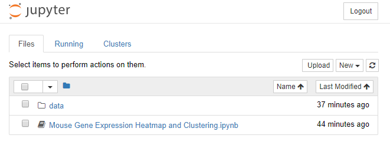
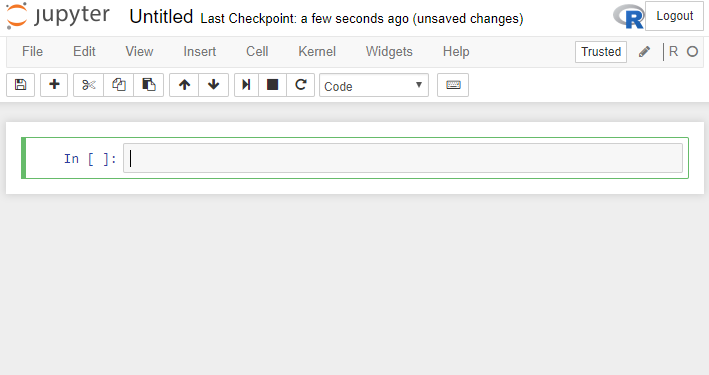
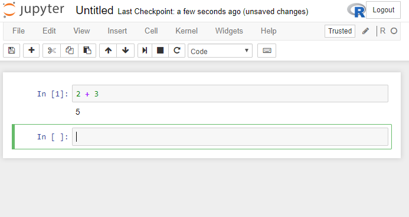
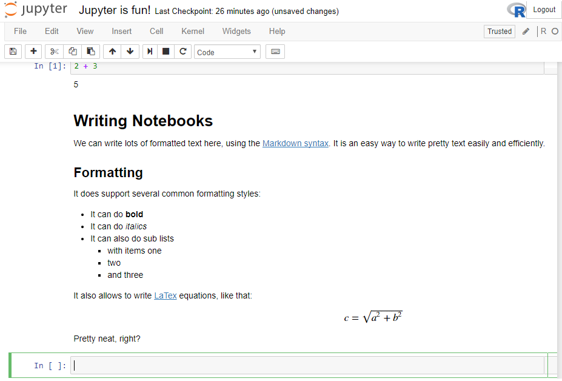
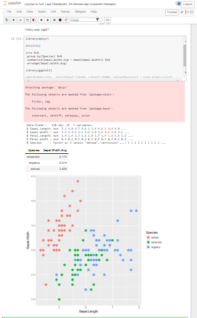
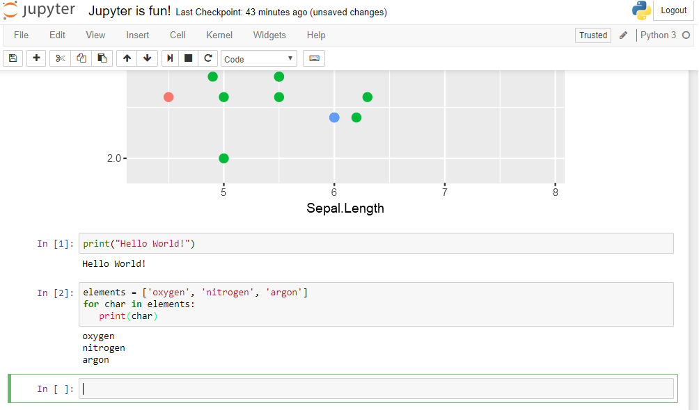

# Jupyter Notebook and Python for data science.

[**Jupyter**](http://jupyter.org/) notebook is an interactive web application that allows you to type and edit lines of code and see the output. The software requires Python installation, but currently supports interaction with over 40 languages.

## So, what **is** a Jupyter notebook?

In this case, "_notebook_" or "_notebook documents_" denote documents that contain both code and rich text elements, such as figures, links, equations, etc. Because of the mix of code and text elements, these documents are the ideal place to bring together an analysis description and its results as well as they can be executed perform the data analysis in real time. These documents are produced by the [Jupyter Notebook App](http://jupyter.org/).

As a fun note, "Jupyter" is a loose acronym meaning [Julia](julialang.org), [Python](https://www.python.org/), and [R](https://www.r-project.org/). These programming languages were the first target languages of the Jupyter application, but nowadays, the notebook technology also supports [many other languages](http://github.com/ipython/ipython/wiki/IPython-kernels-for-other-languages).

The main components of the whole Jupyter environment are, on one hand, the notebooks themselves and the application. On the other hand, you also have a notebook kernel and a notebook dashboard.

And there you have it: the Jupyter Notebook - there are also several [examples of Jupyter notebooks](https://github.com/jupyter/jupyter/wiki/A-gallery-of-interesting-Jupyter-Notebooks) that you can see/browse.

## Cool! How do I install Jupyter.

There are the [official and detailed installation notes](http://jupyter.readthedocs.io/en/latest/install.html), and you can also have a quick look at step-by-step guide and some references [here](jupyter_notebook.rst).

Generally, you'll need to install Python (which is a prerequisite). The general recommendation is that you use the Anaconda distribution to install both Python and the notebook application.


## Ok, I'm set! What's next?

After installation, the only thing necessary is to actually start the notebook. This can be done at command line using the following command:

```
jupyter notebook
```

After running the command, you will see a bunch of information on the command line window, and at the same time, a new page will open on your browser that will look like the following:



There are three main tabs `Files`, `Running` and `Clusters`. You'll be mostly using the first two (when not *in* the actual notebook):
 - `Files`: is the  listing of your current working directory. When you first launch the notebook, the directory is the same where you launched the app.
 - `Running`: is a list of all *active* notebooks, i.e. notebooks that have been running commands through one of the available kernels.
 - `Clusters`: this is a listing of all clusters that are available for a back-end execution (will be empty, unless you have connected the Jupyter Notebook app to a cluster)

### Creating a Notebook

Creating a Notebook is as straightforward as clicking on the `New` button on the top right, and selecting the kernel (i.e. the engine that will be interpreting our commands).

> _Note_ Jupyter really shines for Python and Julia notebooks. R users usually go the RMarkdown, which is much more optimized for R (as opposed to Jupyter). Eventually however, it all comes down to personal preference (or lab inheritance...)

Each notebook looks like this:



You'll notice the following points:

 - There is an `In []` section in the middle. This is called a `cell` and is essentially an interface where you can put your code, text, markdown, etc. Simply put, every cell that is an _input_ is marked as `In` followed by an increasing number that corresponds to the relative order that the particular cell was executed.
 - There is an indication of the current kernel being employed to execute each cell on the top right (in this instance the kernel is R).
 - The notebook is still Untitled, but it has already been saved/created as a file (you can have a look at the working directory to verify this). Bear in mind that Jupyter automatically saves (i.e. autosaves) your notebooks, and also creates **checkpoints**, essentially snapshots of your Notebook that you can go back to (this is **not** versioning, as it doesn't capture all changes, just snapshots in time).

 After writing some code/text in the currently active cell, the main keyboard command to remember is how to execute the code.

 - `Shift-Enter`: Executes the code and creates a new cell underneath.
 - `Ctrl-Enter`: Executes the code _without_ creating a new cell.

 Type the following code into a cell and then hit `Shift-Enter`.

```
2 + 3
```

You will see the following screen (or similar):



First of all, you may have briefly seen an asterisk after `In`, i.e. `In [ * ]`. The asterisk means that the kernel is currently trying to run the code, so you should be waiting for the output. After successful execution, the `*` will change to the next number of the Cell (`1` in our instance), and the output of the command will be visible below (`5` in our case). Finally, as we executed the code with `Shift-Enter`, a brand new cell has been created for us.

At this point, we can rename our Notebook, by clicking on the `Untitled` entry, and let's rename it to `Jupyter is fun!`

Well done! You've just created you first Jupyter Notebook!


### Mingling code and text

One of the most powerful things in Jupyter is the fact that you can write both text and code in the same notebook - much like a real Lab notebook where you have your text notes and your equations/figures/etc.

Let's try and put some text in our notebook. To do that, we need to tell Jupyter that the cell should be interpreted as text (Markdown-formatted) and not as code. Click on the empty cell (it should have a green outline), and then go to `Cell` -> `Cell Type` -> `Markdown`. You will notice that the `In [ ]` indicator just disappeared, as there will be no need to execute something (and therefore no output will be produced).

Let's copy the following text into the cell:

```
# Writing Notebooks

We can write lots of formatted text here, using the [Markdown syntax](https://en.wikipedia.org/wiki/Markdown). It is an easy way to write pretty text easily and efficiently.

## Formatting

It does support several common formatting styles:

- It can do **bold**
- It can do _italics_
- It can also do sub lists
  * with items one
  * two
  * and three

It also allows to write [LaTex](https://www.latex-project.org) equations, like that:

$$c = \sqrt{a^2 + b^2}$$

Pretty neat, right?
```

If you press `Shift-Enter` after putting this text, it should look like that:



You'll also notice that, by default, Jupyter has changed the type of the new cell to `R`, so you won't have to change types constantly, but only when needed.

Finally, let's copy some more R code, to include some graphics as well.

```
library(dplyr)

str(iris)

iris %>%
 group_by(Species) %>%
 summarise(Sepal.Width.Avg = mean(Sepal.Width)) %>%
 arrange(Sepal.Width.Avg)

library(ggplot2)

ggplot(data=iris, aes(x=Sepal.Length, y=Sepal.Width, color=Species)) + geom_point(size=3)
```

`iris` is a small dataset that is included in the `dplyr` package. If you have both `dplyr` and `ggplot2` libraries, installed, you should see something similar to this:




### Combining multiple kernels

A Jupyter Notebook can support multiple Kernels at the same time. Let's try and run a cell using Python 3. Change the cell type to `Python 3` (or `Python 2` if you have a different version installed), and type:

```
print("Hello World!")
```

_(if you're in Python 2, type `print "Hello World!"`)_

You'll notice that the output now is `Hello World!`, while at the same time, the numbering of the cell has reset to `1` - this is because each kernel recognizes it's own cells with the order of execution.

Finally, let's do a quick loop:

```
elements = ['oxygen', 'nitrogen', 'argon']
for char in elements:
   print(char)
```

Here, we have created a list of 3 elements, and we assigned the list to a variable aptly named `elements`. Next, we created a `loop` structure, where each of the elements in the `elements` list is assigned to the variable `char` in turn, and the commands in the loop (i.e. `print(char)`) is executed for that element. You should see a final output similar to this screen:



### Sharing Notebooks

For more instructions, the `Help` menu has a good tour and detailed information. Notebooks can be downloaded locally by going to the `File` menu, then selecting `Download` and choosing a file type to download.

You can also share the entire file that you have just created (there should be a file named `Jupyter is fun!.ipynb` in your working directory). You can even grab the one we created right now from [here](Jupyter is fun!.ipynb).

That's it!

## The Future of Jupyter

According to the people that created and support Jupyter, it has now [~3 million users worldwide](https://github.com/jupyter/design/blob/master/surveys/2015-notebook-ux/analysis/report_dashboard.ipynb), and over 500k Notebooks on GitHub - so huge success!

The same team is now working on [JupyterLab](https://github.com/jupyter/jupyterlab) (currently in alpha), essentially the next generation of the Jupyter Notebook application. You can read more [here](http://blog.jupyter.org/2016/07/14/jupyter-lab-alpha/) and also have a look at their [recent talk at SciPy2016](http://archive.ipython.org/media/SciPy2016JupyterLab.pdf). So, stay tuned!

## Reading material

- Some of the content is from the [Data Camp module](https://www.datacamp.com/community/tutorials/tutorial-jupyter-notebook)

- References for learning Python
  - http://rosalind.info/problems/locations/
  - http://learnpythonthehardway.org/book/
  - http://www.learnpython.org/
  - http://www.pythontutor.com/visualize.html#mode=edit
