# Booting a Jetstream Computer Instance for your use!

What we're going to do here is walk through starting up an running
computer (an "instance") on the Jetstream service.

Below, we've provided screenshots of the whole process. You can click
on them to zoom in a bit.  The important areas to fill in are circled
in red.

Some of the details may vary -- for example, if you have your own XSEDE
account, you may want to log in with that -- and the name of the operating
system or "image" may also vary from "Ubuntu 16.04" depending on the
workshop.

-----

First, go to the Jetstream application at [https://use.jetstream-cloud.org/application](https://use.jetstream-cloud.org/application).

Now:

## Request to log in to the Jetstream Portal

Click the login link in the upper right.

[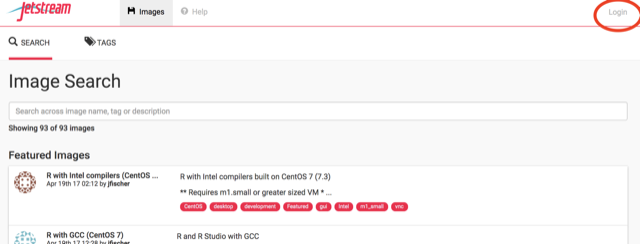](../_images/login-1.png)

## Use "XSEDE"

Choose "XSEDE" as your account provider (it should be the default) and click
on "Continue".
           
[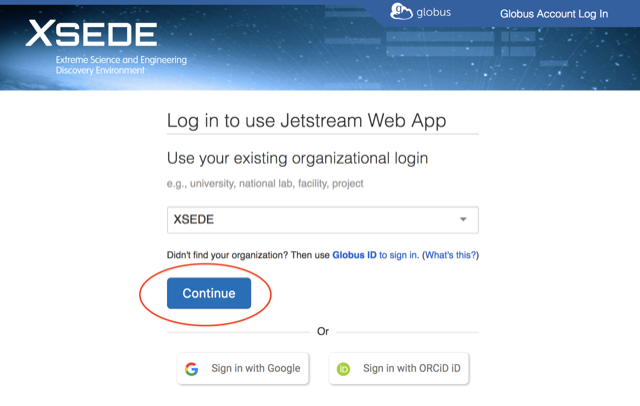](../_images/login-2.png)

## Fill in the username and password and click "Sign in"

Fill in the username, which is 'tx160085' for the ANGUS workshop,
and then enter the password (which we will tell you in class).

[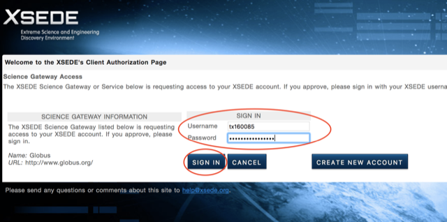](../_images/login-3.png)
           
## Select Projects and "Create New Project"

Now, this is something you only need to once if you have your own
account - but if you're using a shared account like tx160085, you will
need a way to keep your computers separate from everyone else's.

We'll do this with Projects, which give you a bit of a workspace in which
to keep things that belong to "you".

Click on "Projects" up along the top.

[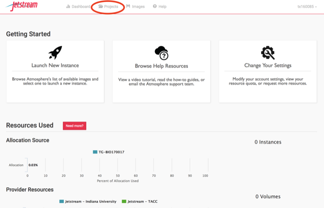](../_images/login-5.png)
           
## Name the project for yourself, click "create"

Enter your name into the Project Name, and something simple like "ANGUS"
into the description. Then click 'create'.

[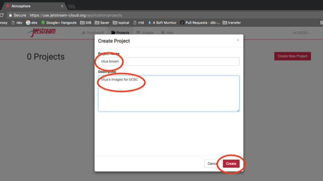](../_images/login-6.png)

## Select the newly created project

Click on your new project!

[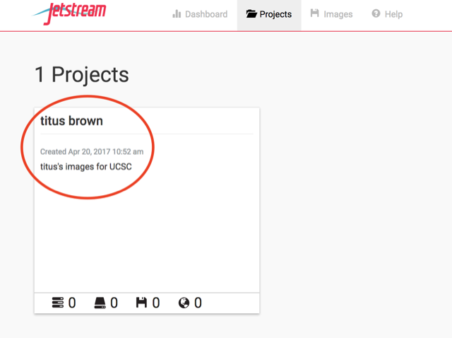](../_images/login-7.png)
           
## Within the project, select "new"

Now, select 'New' and then "Instance" from the dropdown menu to start up a new machine.

[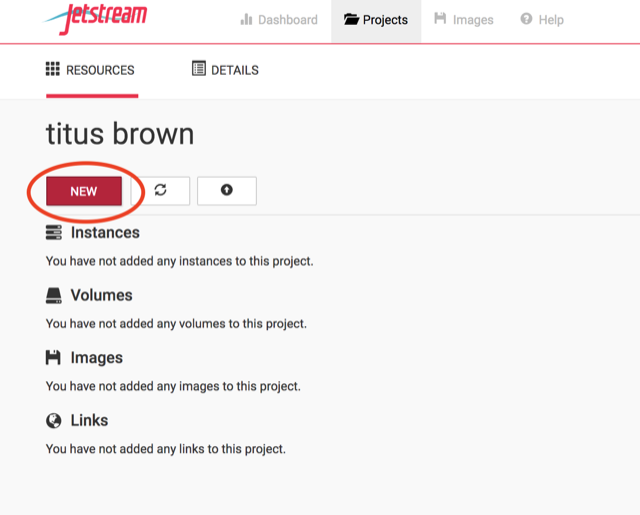](../_images/login-8.png)

## Find the "Ubuntu 16.04" image, click on it

Enter "Ubuntu 16.04" into the search bar - make sure it's from
June 21st, 2017.

[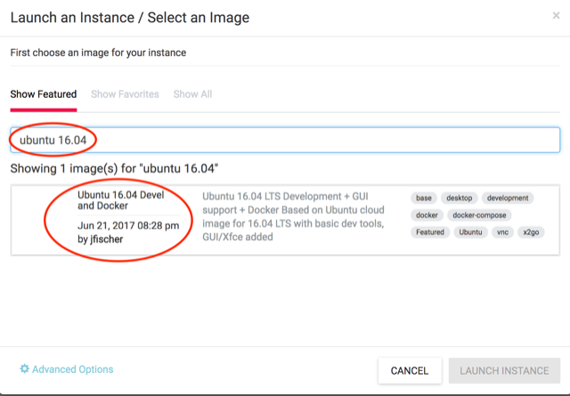](../_images/login-9.png)
           
## Name it something simple and select 'm1.medium'

Change the name after what we're doing - "workshop tutorial", for example,
but it doesn't matter -- and select 'm1.medium'.

[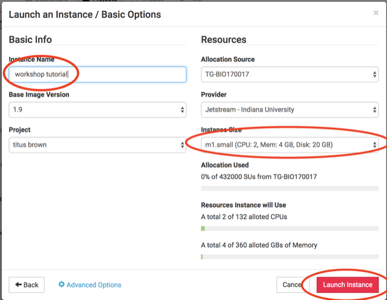](../_images/login-10.png)

## Wait for it to become active

It will now be booting up! This will take 2-10 minutes, depending.
Just wait! Don't reload or anything.

[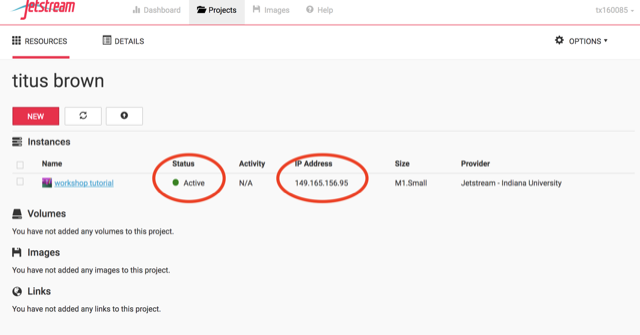](../_images/login-11.png)
           
## Click on your new instance to get more information!

Now, you can either click "Open Web Shell", *or*, if you know how to use ssh,
you can ssh in as user 'tx160085' on the IP address of the machine - see
circled information below.  Note that you'll need to use the private key
file we sent around to everyone in last the pre-workshop e-mail if you decide to
use your system terminal.

[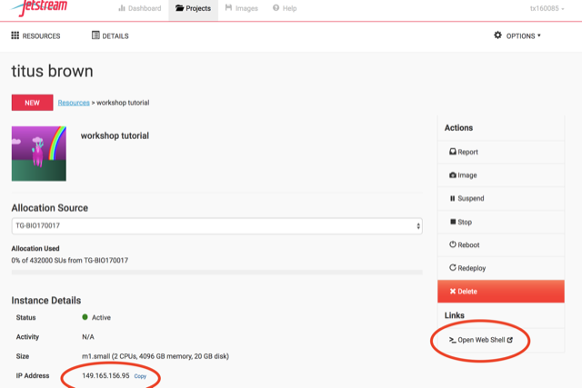](../_images/login-12.png)

## Miscellany

There's a possibility that you'll be confronted with this when you log in to jetstream:

[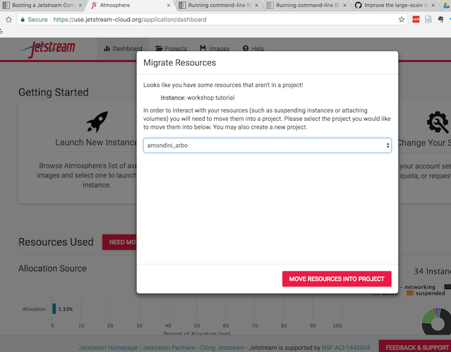](../_images/possible_instance_problem.png)

A refresh of the page should get you past it. Please try not to actually move any instances to
a new project; it's probably someone else's and it could confuse them :)

## Suspend your instance

You can save your workspace so you can return to your instance at a later time without losing any of your files or information stored in memory. Essentially, it is similiar to putting your physical computer to sleep. At the Instance Details screen, select the "Suspend" button. 

[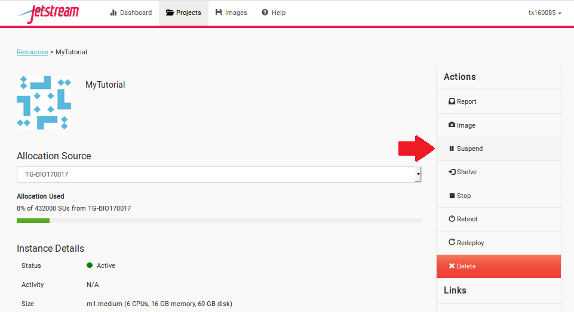](../_images/suspend-1.png)

This will open up a dialogue window. Select the "Yes, suspend this instance" button.

[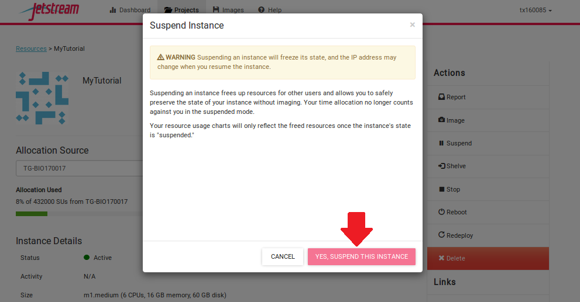](../_images/suspend-2.png)

It may take Jetstream a few minutes to process, so wait until the progress bar says "Suspended."

To *wake-up* your instance, select the "Resume" button.

[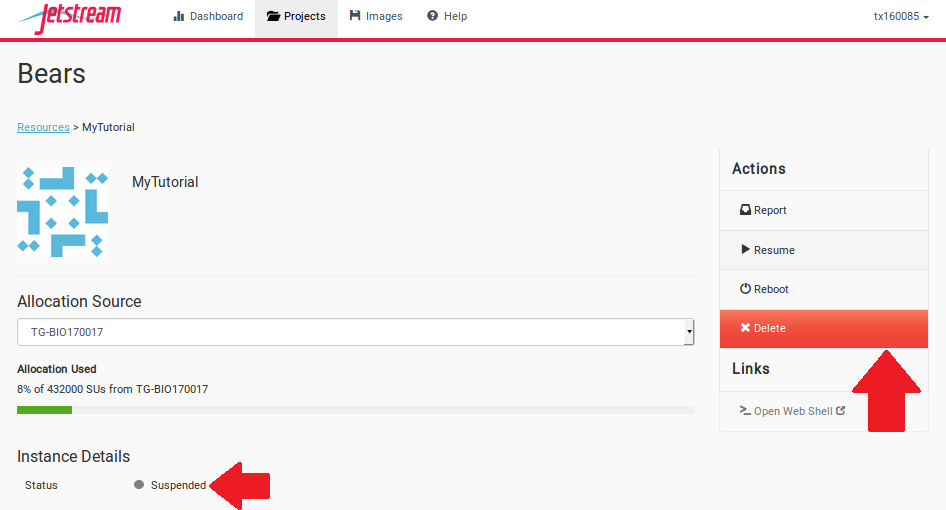](../_images/resume-1.png)

This will open up a dialogue window. Select the "Yes, resume this instance" button. 

[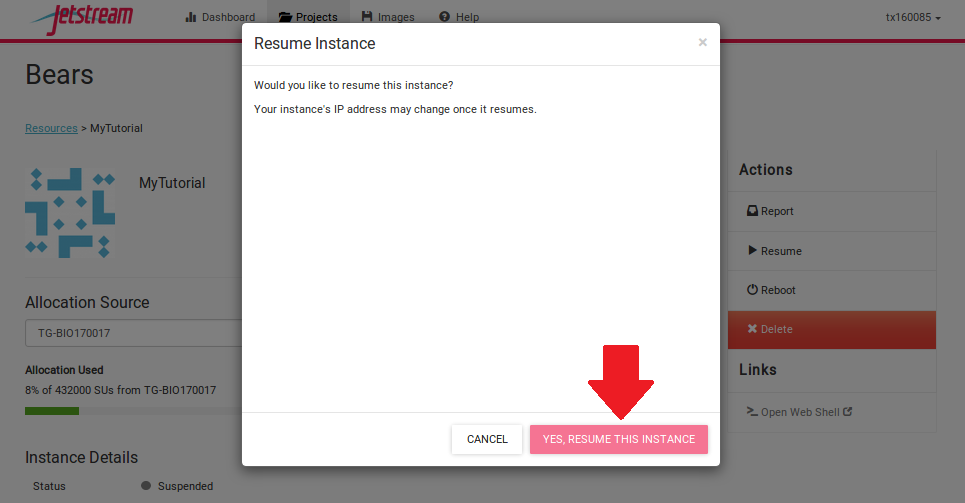](../_images/resume-2.png)

It may take Jetstream a few minutes to process, so wait until the progress bar says "Active." 

## Shutting down your instance

You can shut down your workspace so you can return to your instance another day without losing any of your files. In other words, it is similiar to shutting down your physical computer. You will retain your files, but you will lose any information stored in memory, such as your history on the command line. At the Instance Details screen, select the "Stop" button. 

[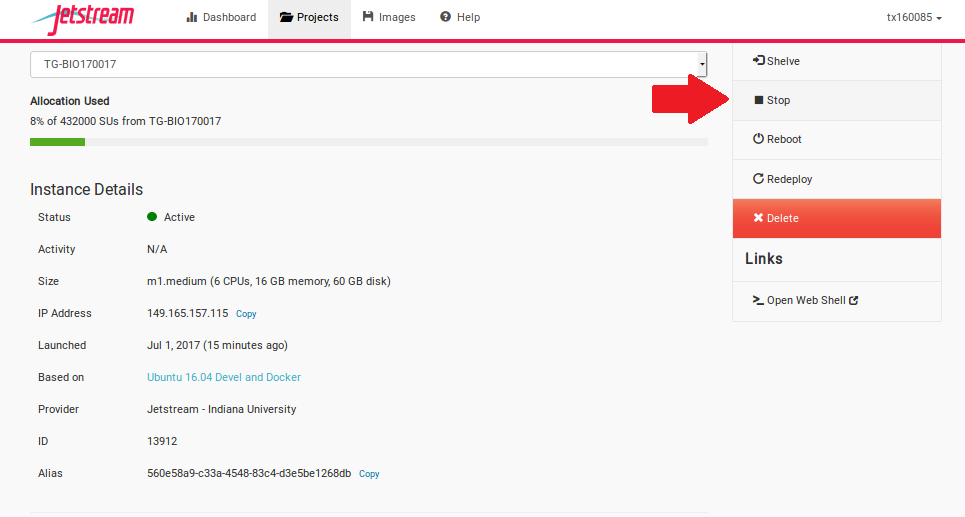](../_images/stop-1.png)

This will open up a dialogue window. Select the "Yes, stop this instance" button.

[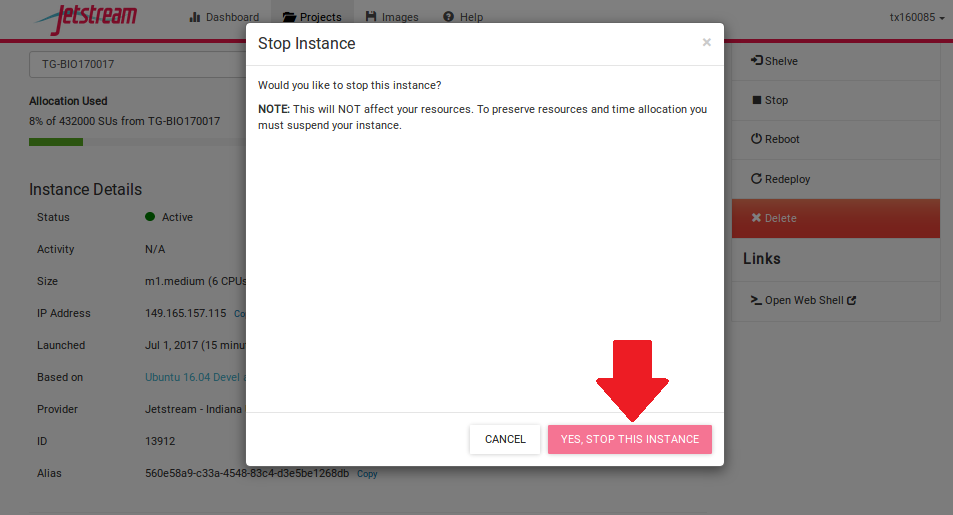](../_images/stop-2.png)

It may take Jetstream a few minutes to process, so wait until the progress bar says "Shutdown."

To start your instance again, select the "Start" button.

[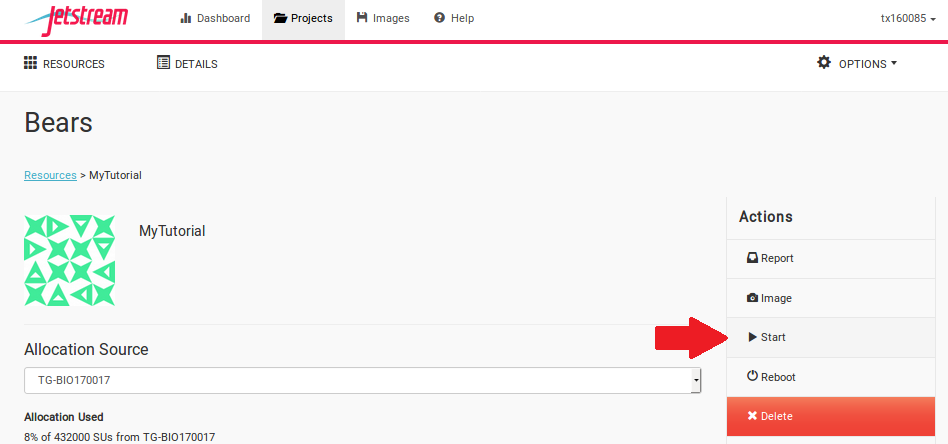](../_images/start-1.png)

This will open up a dialogue window. Select the "Yes, start this instance" button. 

[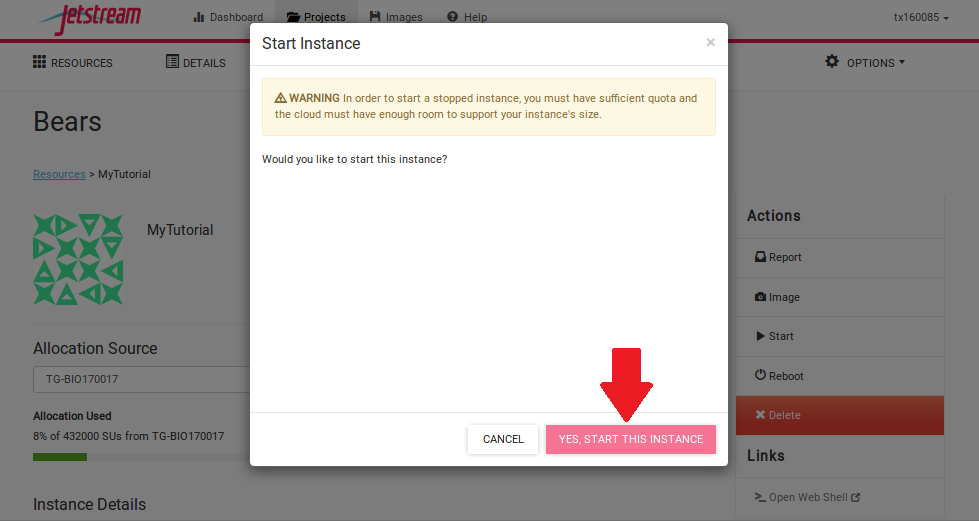](../_images/start-2.png)

It may take Jetstream a few minutes to process, so wait until the progress bar says "Active." 

## Deleting your instance

To completely remove your instance, you can select the "delete" buttom from the instance details page. 

[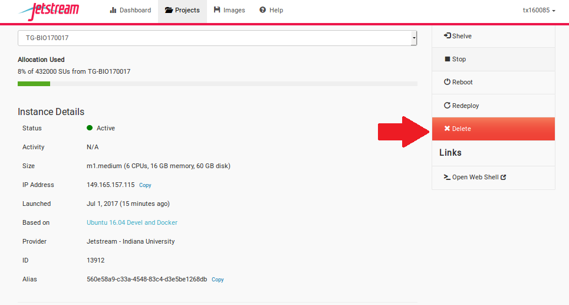](../_images/delete-1.png)

This will open up a dialogue window. Select the "Yes, delete this instance" button.

[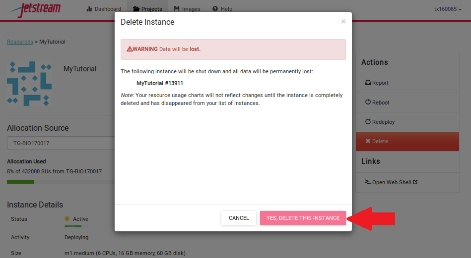](../_images/delete-2.png)

It may take Jetstream a few minutes to process your request. The instance should disappear from the project when it has been successfully deleted. 
